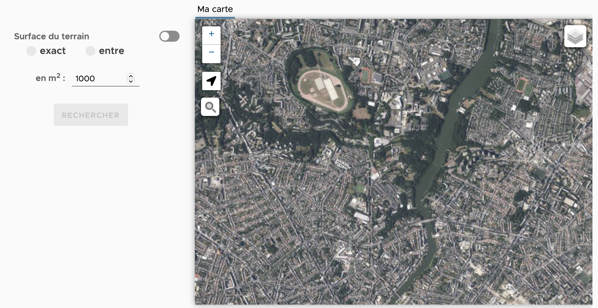
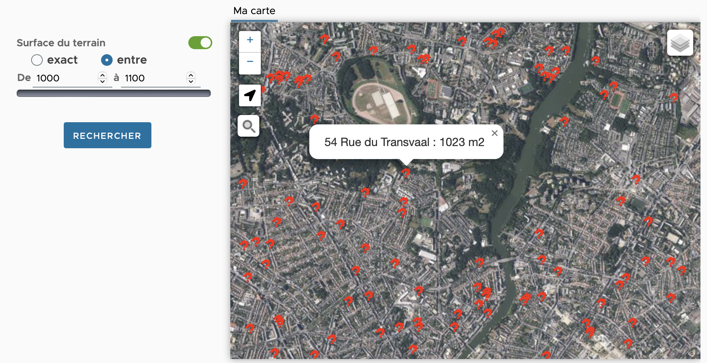
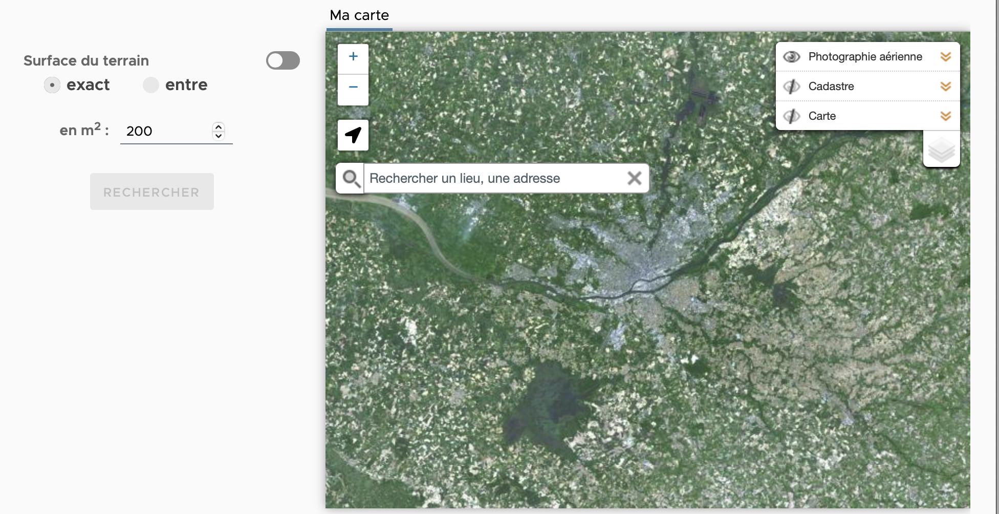
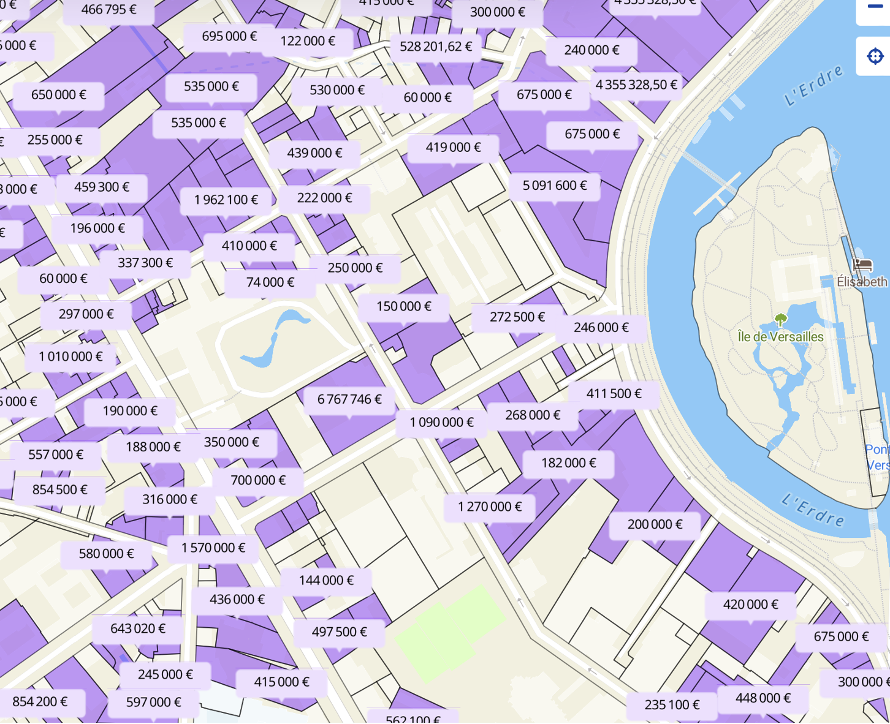

# Sujet Hackathon 

Exemple : [cestou.fr](front.cestou.fr)

 

Dans le cadre de votre module Cloud, l’objectif du Hackcathon est de développer une application SaaS. Cette application doit afficher dans un navigateur une carte et afficher sur cette carte des données issues d’une base de données. Il y'a trois sujets très similaires, seul la base de données et le filtrage est spécifiqiue à chaque sujet. Les concepts restent les mêmes.  

Cette application sera composée d’un frontend et d’un backend.

La partie backend se résume à une BD Postgres et une API permettant d’extraire les données de la BD. Cette api sera développée en python avec Swagger. Elle retournera des données dans un fichier au format json. Dans la BD Postgres se trouve une table contenant des éléments dont une donnée géographique. Cette donnée dépend du sujet (1,2 ou 3).
Le plus simple des accès correspond a une requête géographique demandant toutes les données comprises dans un rectangle. Un rectangle est défini par deux points géographiques, en haut à gauche et en bas à droite. Attention les coordonées sont en LAMB93.

```https://back.cestou.fr/geolocdpe/api/v0/dpe/parcelles?topLeft=6720191.835320397,308768.8204084578&bottomRight=6659443.980490979,402910.7490203984```

Les données peuvent être filtrées par l’utilisateur.

Dans le cas du sujet 3 - Parcelles, nous pouvons filtrer les données, un argument est alors rajouter en fin de reqquette. Ces filtres sont dépendant du sujet, pour le sujet 3 il s'agit d'indiquer une surface pour la parcelle. Le parametre de filtre est donc ```surface=X,Y``` ou on chercher les parcelles dont la taille est supérieur ou égale à X et inférieur ou égale à Y. ```surface=100,100```indique que l'on cherche les parcelles avec pour taille exact 100 m2; ```surface=0,0``` indique que nous prenons toutes les surfaces.

Exemples de requete :

```https://back.cestou.fr/geolocdpe/api/v0/dpe/parcelles?topLeft=6720191.835320397,308768.8204084578&bottomRight=6659443.980490979,402910.7490203984&surface=0,0```

```https://back.cestou.fr/geolocdpe/api/v0/dpe/parcelles?topLeft=6715441.916209222,318207.9851732306&bottomRight=6664099.530719644,393217.0505723774&surface=200,200```

```https://back.cestou.fr/geolocdpe/api/v0/dpe/parcelles?topLeft=6715441.916209222,318207.9851732306&bottomRight=6664099.530719644,393217.0505723774&surface=200,400```

Un fichier json est alors retourné, comme celui ci.

```json
    {
        "id": "44043-1121-3",
        "code_voie": "1121",
        "code_commune": "44043",
        "numero": "3",
        "numero_complet": "3",
        "nom_voie": "Rue des Meuniers",
        "cad_parcelles": "44043000ZI0175",
        "x": 378327.30322954623,
        "y": 6675494.4920270955,
        "geom": "01010000206A08000061CE81365D171741375F7D9F09775941",
        "contenance": 200
    },
    {
        "id": "44155-C620-7",
        "code_voie": "C620",
        "code_commune": "44155",
        "numero": "7",
        "numero_complet": "7",
        "nom_voie": "La Sorinière",
        "cad_parcelles": "441550000H0725",
        "x": 351955.4522180382,
        "y": 6669010.108935007,
        "geom": "01010000206A080000D33E12CF4D7B154189CAF886B4705941",
        "contenance": 200
    }
```
     
Ces données sont alors afficher sur la carte.
 


Coté frontend, le hackathon souhaite utiliser angular comme framwork.
On utilisera [leaflet](https://leafletjs.com) pour afficher une carte dans un composant angular. On utilisera [geoportal-extensions-leaflet](https://geoservices.ign.fr/documentation/services/utilisation-web/extension-pour-leaflet) pour les fonds de carte et outils.

Comme leaflet et geoportal-extensions-leaflet ne sont pas en type script, il faut definir le fichier des types pour leaflet et geoportal-extensions-leaflet:

* ```cd node_modules/@types```
* ```mkdir leaflet```
* ```mkdir geoportal-extensions-leaflet```
* ```cd leaflet```
* ```rm index.d.ts```
* ```echo declare module "'leaflet'">> index.d.ts```
* ```cd ../geoportal-extensions-leaflet```
* ```echo declare module "'geoportal-extensions-leaflet'">> index.d.ts```


En effet, il s'agit de definir le fichier de type qui sera utilisé par typescript, car ces bibliothèques sont des bibliothèques javascript, d'où l'interet de definir les fichiers types.
On vous demande de tester une bibliotheque leaflet adaptée pour angular (cependant nous ne l'avons pas testé) qui se trouve [ici](https://github.com/bluehalo/ngx-leaflet).

Cette combinaison dans composant angular que vous nommerez "map" permet d'afficher rapidement et simplement une carte avec quelques fonctionnalités. 

 

On peut facilement naviguer dans cette carte. Le principe de base est de récupérer les coordonées top-left et bottom-rigth à chaque fois que l'on bouge la carte (déplacement ou zoom). 

```js
  updateCoordinates = () => {
    console.log("update_coordinates")

    if (this.map) {
      //on recupère les coordonnées de la fenetre affichée
      const bounds = this.map.getBounds();
      const topLeft = bounds.getNorthWest();
      const topRight = bounds.getNorthEast();
      const bottomLeft = bounds.getSouthWest();
      const bottomRight = bounds.getSouthEast();
      
      //on met à jour la variable coordinates
      this.mapService.setCoordinates({
        topLeft: this.mapService.toLambert93(topLeft.lat, topLeft.lng),
        topRight: this.mapService.toLambert93(topRight.lat, topRight.lng),
        bottomLeft: this.mapService.toLambert93(bottomLeft.lat, bottomLeft.lng),
        bottomRight: this.mapService.toLambert93(bottomRight.lat, bottomRight.lng)
      });
      
      //on recupère les points dans la fenetre affichée
		this.getData()
		
		// et on affiche les maker
		this.updateMarkersSurface(data)
		
// la methode getData

async getData(): Promise<any[] > {
    const topLeft = this.mapService.getCoordinates().topLeft;
    const bottomRight = this.mapService.getCoordinates().bottomRight;
    const surface_min = this.formService.getSurface().surface_min
    const surface_max = this.formService.getSurface().surface_max
    const url =  `${environment.IP}/geolocdpe/api/v0/dpe/parcelles?topLeft=${topLeft[1]},${topLeft[0]}&bottomRight=${bottomRight[1]},${bottomRight[0]}&surface=${surface_min},${surface_max}`

    try{
      const res = await fetch(url);
      const data = await res.json()
      return data
    }catch (error) {
      console.error('Error:', error);
      throw error;
    } 
  }

// 
updateMarkersSurface(data: DataFromAPISurface[]) {
    this.map.eachLayer((layer: any) => {
      if (layer instanceof L.Marker) {
        this.map.removeLayer(layer);
      }
    });
    data.forEach(point => {
      let standardCood = this.mapService.toStandardCoordinate(point.y, point.x)
      
      const marker = L.marker([standardCood[1], standardCood[0]], { icon: this.icone })
      
      let popupContent =  ` ${point.numero} ${point.nom_voie} : ${point.contenance} m2`
      
      marker.bindPopup(popupContent, {
        offset: [0, 35]
      }).on("popupopen", () => {
        const button = $(".btn-primary");
        button.on("click", () => {
          found();
        });
      });
      this.map.addLayer(marker);
     });
  }

```

Le code n'est donné ici qu'à titre indicatif pour donner une idée de la réalisation.
Deux services doivent être développé dans cet exemple pour l'application, l'un pour le composant "map" l'autre pour le composant "form".
Ces services angular servent principalement à de l'échange de donner entre le composant "map" et le composant "form"

Ce composant "form" va permettre à l'utilisateur de parametrer ces filtres. C'est globalement une interface permettant de spécifier la valeur de chaque parametre. Dans l'exemple donnée, nous n'avons qu'un seul paramaitre, ```surface``` qui possède deux valeurs ```min et max```.
Pour permettre à l'utilisateur de modifier ces paramaitres, une petite interface a été développé. Suivant le sujet (de 1 à 3) l'interface sera évidement à modifier.
      
   
## sujet 2 : DVF
Les données concernent les prix de vente des bien immobilier. La base de donnée fournie contient les données suivante.


Les champs imporntant sont ```longitude```et ```latitude``` qui serviront a trouver les biens à afficher dans leaflet. Les filtres seront sur ```valeur_fonciere```et ```date_mutation```.
On souhaite pouvoir afficher un marker soit pour tous les biens quelque soit le prix, soit les biens dont le prix est comprix entre ```min```et```max```.
On veut également pourvoir filtrer sur la date de la vente, soit afficher quelque soit la date, soit les biens vendus entre deux date. Pour cela il faut filtrer sur le champs ```date_mutation```. 

Enfin, nous ne prenons en compte que la vente des maisons, le ```type_local``` doit être égal à ```Maison```
Il faut afficher sur la carte non as un marqueur mais le prix du bien.

| Clé                       | Valeur                     |     |
|----------------------------|----------------------------|------|
| id_mutation               | un identifiant                 |                                                                        |
| date_mutation             | la date de la vente              |                                                                        |
| numero_disposition        | un identifiant                      |                                                                        |
| nature_mutation           | Vente                      |                                                                        |
| valeur_fonciere           | 1le prix vendu                  |                                                                        |
| adresse_numero            | 184                        |                                                                        |
| adresse_suffixe           |                            |                                                                        |
| adresse_nom_voie          | ALL DES HETRES             |                                                                        |
| adresse_code_voie         | 0124                       |                                                                        |
| code_postal               | 01630                      |                                                                        |
| code_commune              | 01354                      |                                                                        |
| nom_commune               | Saint-Genis-Pouilly        |                                                                        |
| code_departement          | 01                         |                                                                        |
| ancien_code_commune       |                            |                                                                        |
| ancien_nom_commune        |                            |                                                                        |
| id_parcelle               | 01354000BD0334             |                                                                        |
| ancien_id_parcelle        |                            |                                                                        |
| numero_volume             |                            |                                                                        |
| lot1_numero               | 29                         |                                                                        |
| lot1_surface_carrez       |                            |                                                                        |
| lot2_numero               |                            |                                                                        |
| lot2_surface_carrez       |                            |                                                                        |
| lot3_numero               |                            |                                                                        |
| lot3_surface_carrez       |                            |                                                                        |
| lot4_numero               |                            |                                                                        |
| lot4_surface_carrez       |                            |                                                                        |
| lot5_numero               |                            |                                                                        |
| lot5_surface_carrez       |                            |                                                                        |
| nombre_lots               | 1                          |                                                                        |
| code_type_local           | 3                          |                                                                        |
| type_local                | le type du bien                 |                                                                        |
| surface_reelle_bati       |                            |                                                                        |
| nombre_pieces_principales | 0                          |                                                                        |
| code_nature_culture       |                            |                                                                        |
| nature_culture            |                            |                                                                        |
| code_nature_culture_speciale |                            |                                                                        |
| nature_culture_speciale   |                            |                                                                        |
| surface_terrain           |                            |                                                                        |
| longitude                 | X                 |                                                                        |
| latitude                  | Y                 |                                                                        |
| Source                    |                            | 





#Pour la beauté
Réunissez dans une meme interface les trois sujets pour permettre la navigation sur une carte et filtrer des données sur le DPE, le DVF et les Parcelles.
Gardez vos trois API, il s'agit ici d'unifier le composant "form" et de permettre de multiples affichages de markeur sur la carte.
