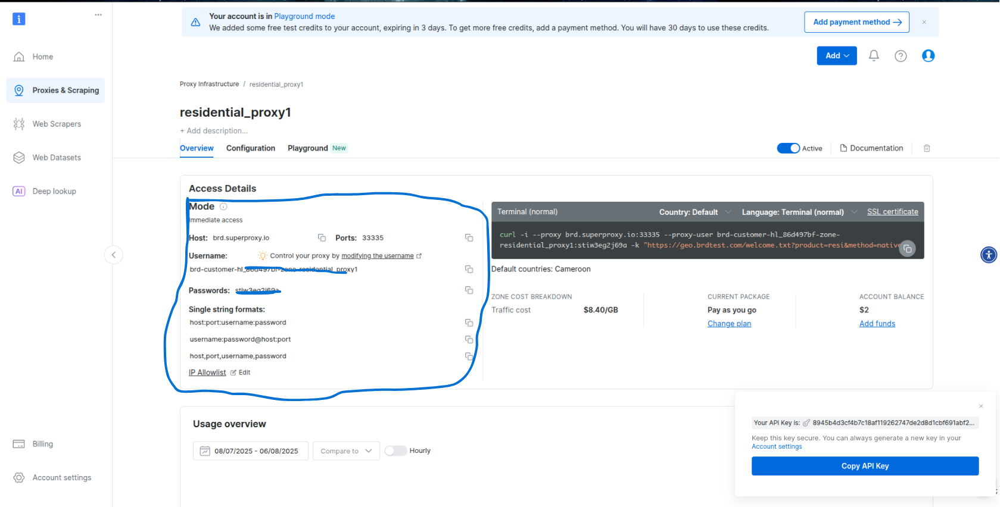

+---------------------------------------------------+
## README - API de Scraping Leboncoin avec Proxy 
+---------------------------------------------------+

Ce API Python permet de scraper des annonces immobilières sur Leboncoin, de sauvegarder les données dans une base de données PostgreSQL et dans un fichier Json, de télécharger des images via un proxy Bright Data, afin de générer des graphiques d'analyse de performance.

### Prérequis
-------------
- **Acceder au repertoire du script**
```bash
cd seloger_ws_proxy_api
```

- **Installation de playwright**
```bash
playwright install
```

- **Creation du fichier des variables d'environement**
```bash
cp .env.example .env 
```

- **Compte Bright Data** :
    * Un compte [Bright Data](https://brightdata.com)
    

    * Cliquer sur **Get start for free** et creer votre compte avec le service souhaité
    

    * CLiquer sur **Proxies & Scarping**
    

    * Cliquer sur le boutton **Get start** de **Residential proxies**
    

    * renseigner les informations souhaité et creer le proxy residentiel et cliquer sur le boutton **ADD** pour terminer la creation
    


    * Apres creation du proxy residentiel pour avoir les informations(**BRIGHT_DATA_CUSTOMER_ID, BRIGHT_DATA_ZONE, BRIGHT_DATA_PASSWORD**) pour le proxy residentiel a renseigner dans le fichier **.env** crée plus haut et la section pour recuperer ces informations sont encerclé en bleu sur l'image suivante
    

    * Concernant la creation du deuxieme proxy qui est le **Browser-AUTH** nous allons revenir a a la page de depart en cliquant sur **Proxies & Scarping** de la sidebar et Cliquer sur le boutton **Get start** de **Residential proxies**
    sur la page de l'image precedente et cliquer sur **Unlock browser access now** dans la fenetre en bleu
    

    * Sur la page de obtenu l'information a enregistrer dans le fichier **.env** sur **BRIGHT_DATA_BROWSER_AUTH** est encerclé en bleu sur l'image suivante.
    


### Configuration
-----------------

- **configuration Bright Data** :
Remplacez les identifiants dans le fichier **.env** crée plus tot:
    - **BRIGHT_DATA_CUSTOMER_ID**, **BRIGHT_DATA_ZONE**, **BRIGHT_DATA_PASSWORD** pour les proxies HTTP, ces information sont celle du **Residential proxies** que vous avez crée.
    - **BRIGHT_DATA_BROWSER_AUTH** pour le navigateur Bright Data representant les informations du **BrowserAUTH** que vous avez crée.

- **Base de données PostgreSQL** :

Créez une base de données nommée **immo_bd** si elle n'est pas encore crée.
ensuite renseigner toutes les informations necessaire a la configuraion de la dase de données dans la section adequate du fichier **.env**

```bash
POSTGRESQL_HOST=localhost
POSTGRESQL_PROST=5432
POSTGRESQL_DATABASE_NAME=DATABASE_NAME
POSTGRESQL_USER=USERNAME
POSTGRESQL_PASSWORD=PASSWORD
```

Assurez-vous que le serveur PostgreSQL est en cours d'exécution.


### Dossier de sortie :
----------------------
L'api  crée un dossier scraped_data pour stocker les JSON, images et captures d'écran.
Assurez-vous que l'utilisateur a les permissions d'écriture dans le répertoire de travail.


### Utilisation

Declenchement de l'api flask en executant la commande suivantre:

```bash
python main.py
```

### L'API FLASK :
- Scrape les données de l'annonce (adresse, prix, type, surface, etc.).
- Télécharge les images via le proxy Bright Data.
- Sauvegarde les données dans scraped_data/<timestamp>/ (JSON, images, capture d'écran).
- Enregistre les données dans la base de données immo_bd.
- Génère un graphique de performance (performance_analysis.png).

### Notes
----------
L'api utilise la plateforme de proxy Bright Data par requête (paramètre proxy_count=1).
Les tentatives de connexion échouées sont retentées jusqu'à 3 fois avec un délai exponentiel.
Assurez-vous d'avoir une connexion réseau stable pour éviter les erreurs de timeout.

